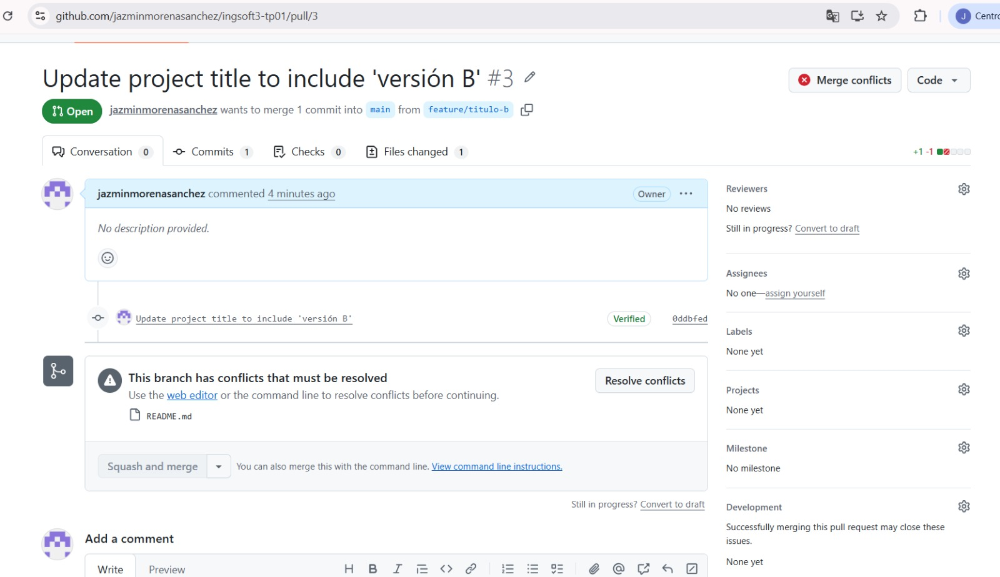
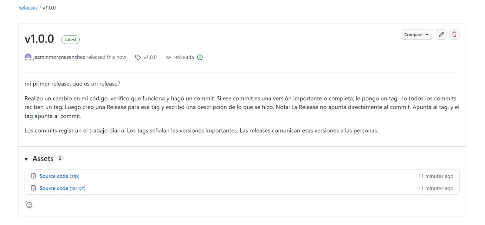
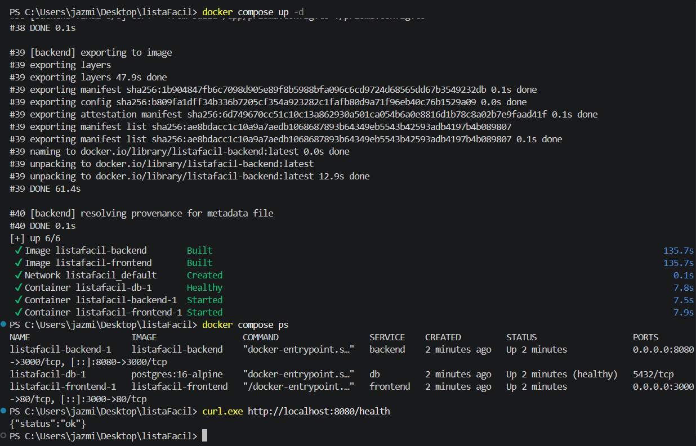
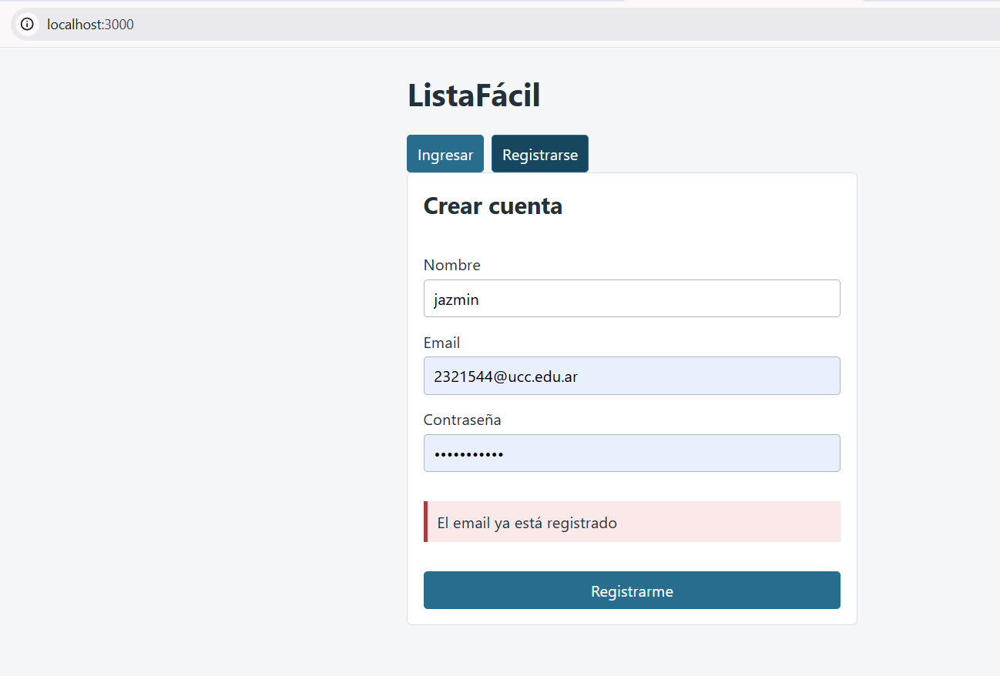
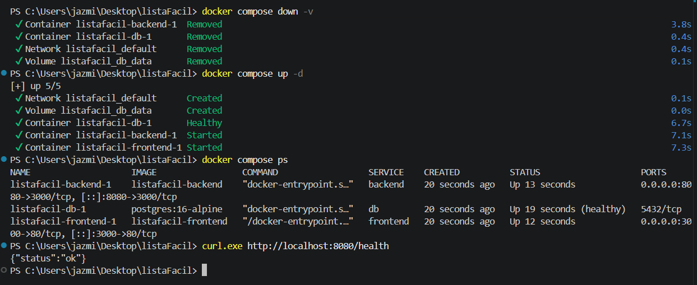
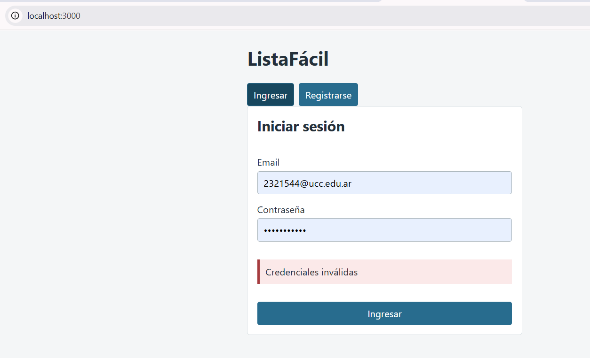
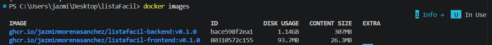

# Evidencias — TP1

## 1. Push directo a main rechazado

GitHub rechaza el push directo porque la rama `main` está protegida y la regla también alcanza al dueño del repositorio.

## 2. Conflicto en el PR de la rama B

GitHub detecta un conflicto entre las ramas A y B porque ambas modificaron la misma línea del README.

## 3. Marcadores del conflicto

GitHub muestra los marcadores del conflicto con las dos versiones de la línea. elegimos luego solo una versión.

## 4. Release v1.0.0 publicada

Se muestra la release `v1.0.0` publicada a partir del tag creado para la primera versión del TP.

## Evidencias TP2

### Docker Compose y funcionamiento del sistema

Se levantó la aplicación completa desde cero utilizando `docker compose up -d`.  
Se verificó con `docker compose ps` que los tres servicios (`frontend`, `backend` y `db`) se encontraran en ejecución y que PostgreSQL alcanzara el estado `healthy`.

Finalmente, se comprobó el funcionamiento del backend mediante el endpoint `/health`, que respondió correctamente con `{"status":"ok"}`.

Con esto logramos evidenciar que después de eliminar y recrear los contenedores, se intenta registrar nuevamente un usuario que ya existía y la aplicación indica que el email continua registrado, demostrando que los datos de PostgreSQL se conservaron en el volumen `db_data`.

### Persistencia de los datos

Continuando con la evidencia anterior, para comprobar la persistencia de PostgreSQL, primero se ejecutó `docker compose down` y luego `docker compose up -d`. Al volver a levantar los contenedores, el usuario creado anteriormente continuaba registrado, demostrando que los datos se conservaron en el volumen `db_data`.

Luego se ejecutó:

`docker compose down -v`

En este caso Docker eliminó también el volumen `listafacil_db_data`. Al volver a levantar la aplicación con `docker compose up -d`, Docker creó un nuevo volumen y el usuario que existía anteriormente dejó de estar registrado, como se observa al intentar iniciar sesión con las mismas credenciales.

Esto demuestra que los datos sobreviven a la eliminación de los contenedores mediante `down`, pero se eliminan cuando también se elimina el volumen mediante `down -v`.

Aca vemos como al intentar entrar con el mismo usario que ya habiamos registrado no logramos ingresar.

### Comparación de tamaños de la imagen

En ListaFácil, al utilizar Node.js + TypeScript, se construyó explícitamente la etapa de compilación como mi-backend:build para compararla con la imagen final mi-backend:dev. La etapa de build tiene un CONTENT SIZE de 318 MB, mientras que la imagen final tiene 308 MB.

La etapa de compilación contiene las herramientas y dependencias necesarias para generar Prisma Client y compilar TypeScript. En la etapa final se utiliza npm ci --omit=dev, por lo que se excluyen las dependencias utilizadas únicamente durante desarrollo y compilación. Prisma CLI sí se conserva porque es necesario para ejecutar prisma migrate deploy al iniciar el backend.

Esto refleja el objetivo del multi-stage build: separar construcción y ejecución, evitando trasladar a la imagen final herramientas de desarrollo innecesarias.

### Imágenes publicadas en el registry

Se publicaron las imágenes del backend y frontend de ListaFácil en GitHub Container Registry utilizando el tag semántico `v0.1.0`.

